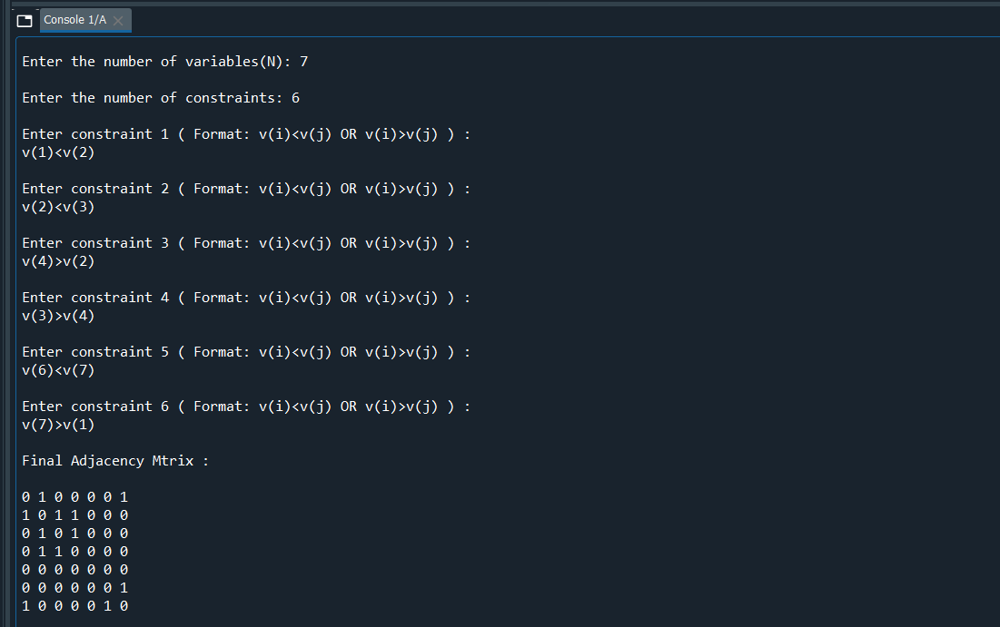
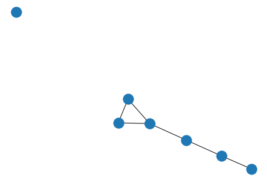

# constraint_graphs

The program builds an adjacency matrix to determine a constraint graph from a given set of variables and a set of binary constraints.  

The program takes an input N – the number of variables. ( This would be the number of nodes in the constraint graph . The user is free to add any number of variables they want to. ) 

From this value of N, we assume that the variables are V(1), V(2) .... V(N) 

Then we input the value for the number of constraints, the program then asks to enter those many number of constraints. The constraints should be necessarily binary involving either '<' or '>' operators only.
The program is essentially a simple parser that checks each line of constraint and sees which variables are involved in that constraint. Based on the output of the parser the program decides which nodes have edges between them.

For example, 

Enter the number of variables(N): 7

Enter the number of constraints: 6

Enter constraint 1 ( Format: v(i)<v(j) OR v(i)>v(j) ) : 
v(1)<v(2) 

Enter constraint 2 ( Format: v(i)<v(j) OR v(i)>v(j) ) : 
v(2)<v(3)

Enter constraint 3 ( Format: v(i)<v(j) OR v(i)>v(j) ) : 
v(4)>v(2)

Enter constraint 4 ( Format: v(i)<v(j) OR v(i)>v(j) ) : 
v(3)>v(4)

Enter constraint 5 ( Format: v(i)<v(j) OR v(i)>v(j) ) : 
v(6)<v(7)

Enter constraint 6 ( Format: v(i)<v(j) OR v(i)>v(j) ) : 
v(7)>v(1)

 
The program returns the adjacency matrix and plots the constraint graph.

<h2>INPUT AND OUTPUT FOR THE ABOVE EXAMPLE</h2>

 

 
